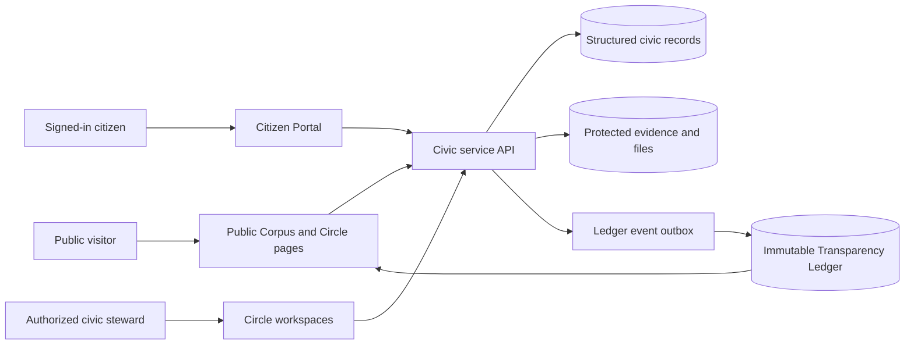
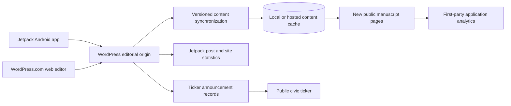
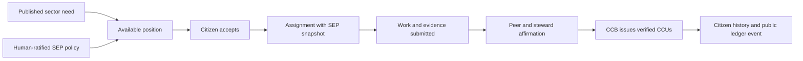

# Utopian Society Civic Portal — Local Development Plan

**Status:** Draft 1.1  
**Work mode:** Local development only during OpenAI Build Week judging  
**Production baseline:** Frozen except for the published judging notice  
**Earliest scheduled public update:** Spiraday, Solvane 28, Utopian Year 1 (Gregorian reference: August 6, 2026)

## 1. Outcome

The next stage of the portal should demonstrate how one person actually lives within the Society. It should not become a collection of unrelated forms or dashboard cards.

The defining demonstration is a citizen who can:

1. Enter a coherent civic account.
2. Understand their immigration standing, Learning path, Contribution role, CCU account, residence, and Harmony status.
3. Complete a contribution loop from opportunity through affirmation and credit.
4. Use earned credits within a simulated civic market.
5. Request a change in residence and receive a reviewable decision.
6. Bring or answer a Harm through a privacy-conscious restorative process.
7. See every institutionally meaningful action produce an appropriate Transparency Ledger event.

The platform must also restore the founder's ordinary operating tools. The public redesign is not complete if it prevents convenient Android or web publishing, featured-image management, post editing, ticker announcements, or trustworthy traffic review. WordPress and Jetpack compatibility are therefore treated as operational infrastructure rather than optional legacy support.

## 2. Governing implementation principles

1. **Build complete civic loops.** Finish one end-to-end experience before opening several new unfinished surfaces.
2. **The citizen is the center.** Accounts represent civic identity and relationships, not merely login credentials.
3. **Corpus authority remains visible.** Every service identifies its Circle, governing document, authority, limits, review path, and responsible actor.
4. **Utopian dates are primary.** Gregorian dates remain archival or conversion references.
5. **Privacy is structural.** Private case data, Circle-confidential records, and public ledger events are separate records—not the same record with fields hidden by styling.
6. **The public ledger is append-only.** Corrections supersede earlier events; they do not rewrite history.
7. **CCU accounting is transactional.** Balances are derived from immutable postings rather than edited as a single number.
8. **AI may assist procedure but may not exercise civic authority.** It may explain, summarize, compare evidence, identify controlling text, and draft options. It may not diagnose, determine guilt, impose restoration, deny housing, rank human worth, or make final eligibility decisions.
9. **Local means local.** Development uses a local database, local seed citizens, and mock authentication. It must not write to the production citizen register, ledger, or any live civic service.
10. **Preserve the editorial control plane.** WordPress should remain the canonical authoring and editorial-history system when it can be reconnected safely; the new application may render and enrich that content without silently forking it.
11. **Analytics remain attributable.** Jetpack statistics, first-party application analytics, and civic-ledger counts must retain their source and methodology. Unlike measurements must not be merged into one unexplained total.

## 3. Existing foundation

The project already contains:

- The four-ring frontispiece and layered civic navigation.
- Seven Foundational Circles plus operational bodies and Time & Observance.
- Public Circle landing pages and non-persistent civic action prototypes.
- A working Immigration assessment, oath, certificate, Citizen Register, population count, and exit path.
- A public, immutable Transparency Ledger with automatic release ingestion.
- A Cloudflare Worker and D1 database supporting citizens, certificates, population, and ledger events.
- A prepared sign-in helper, although no protected citizen account currently uses it.
- Public Learning, Healing, Immigration, and Circle experiences that establish the visual and interaction language.
- A published-content snapshot imported from WordPress into the new local manuscript template.

The redesign currently has an operational regression: the public domain no longer behaves as the original WordPress site, so the Jetpack Android and WordPress web workflows can no longer be relied upon for convenient publishing, media handling, or statistics. New posts also require a manual import/build cycle, and static ticker announcements remain coupled to source-code deployment. Restoring that control plane is an immediate prerequisite for sustainable operation.

The plan extends these foundations rather than replacing them.

The Circle of Contribution implementation is additionally governed by the companion feasibility review in `CONTRIBUTION_CHARTER_FEASIBILITY_REVIEW.md`. Where the aspirational Charter does not yet specify an executable rule, the local portal must display a simulation or pending-policy state rather than silently inventing civic law.

## 4. System spine

During the freeze, `DB`, authentication, and file storage are local substitutes. Production bindings are not touched.

### Publishing and observability bridge

The preferred architecture is hybrid: WordPress remains the editorial source of truth and the new site remains the presentation and civic-application layer. This preserves the established Android and web authoring tools without forcing the frontispiece, corpus templates, or civic portal back into a WordPress theme.

The integration will use WordPress.com site identity and REST endpoints rather than scraping rendered pages. OAuth credentials remain server-side and request only the scopes required for posts, media, taxonomy, and statistics. Public content may be cached for resilience, but WordPress post IDs and modification timestamps remain authoritative for synchronization.

## 5. Canonical civic objects

These objects should become the shared vocabulary of the platform.

| Object | Purpose | Primary steward |
|---|---|---|
| Citizen | Civic identity, standing, public civic name, certificate, preferences | Immigration / civic administration |
| Identity Link | Private connection between a login identity and a civic identity | Platform administration |
| Learning Profile | Current tier, pathways, capabilities, enrollments, mentorship | Learning |
| Contribution Profile | Skills, interests, accessibility, rhythm, protected rest | Contribution |
| Position | Available civic role, sector need, qualifications, support, SEP context | Contribution |
| Assignment | A citizen’s accepted contribution with status and completion evidence | Contribution |
| Affirmation | Independent verification of contribution and its civic effect | Affirmation |
| SEP Snapshot | Versioned inputs and adjustment applied at a particular decision | Contribution / Balance review |
| CCU Account | Citizen or institutional credit account | CCB |
| CCU Transaction | Balanced, immutable credit movement with reason and source | CCB |
| Catalog Item | Internal or imported enrichment good or service | Civic market / FTB where applicable |
| Inventory Record | Availability, source, reservation, and fulfillment | Contribution / Custodianship |
| Trade Adjustment | External market rate and import/export exposure at a point in time | FTB |
| Household | People considered together for residence and shared needs | Custodianship |
| Residence | Dwelling, capacity, accessibility, occupancy, and status | Custodianship |
| Housing Request | Requested change, reason, household context, alternatives, and outcome | Custodianship |
| Harm | A private report of injury, conflict, or procedural concern | Harmony |
| Harm Party | Person bringing, answering, witnessing, or supporting a Harm | Harmony |
| Proceeding | Intake, safety, consent, scheduling, conference, outcome, and appeal | Harmony |
| Decision | A reviewable institutional determination with authority and rationale | Responsible Circle |
| Ledger Event | Publicly appropriate account of a meaningful civic action | Transparency Ledger |
| Publication | WordPress-authored post, page, status, slug, U-date, revision identity, and canonical source | Editorial administration |
| Media Asset | Featured image or attached media with source identity, attribution, dimensions, and local cache state | Editorial administration |
| Ticker Announcement | Scheduled editorial notice with priority, start and end U-dates, destination, and publication state | Editorial administration / responsible Circle |
| Content Sync Checkpoint | Last successful WordPress import, cursor, changed records, failures, and retry state | Platform administration |
| Analytics Snapshot | Source-labeled Jetpack or first-party aggregate measurement and collection interval | Platform administration |

## 6. Privacy and visibility model

| Level | Examples | Visibility |
|---|---|---|
| Public civic record | Civic name, certificate number, standing, U-date, Circle decision summary, service status | Anyone |
| Citizen-private | Login identity, contact details, complete account history, requests involving the citizen | Citizen and explicitly authorized stewards |
| Circle-confidential | Medical details, Harm testimony, private residence reasons, protected evidence | Narrow role-based access with access logging |
| Public procedural record | Case number, responsible body, stage, authority, non-sensitive outcome, appeal status | Anyone |
| Aggregate public data | Capacity, open positions, housing availability, caseload, CCU circulation | Anyone, with methodology and privacy thresholds |

Immigration may retain an accurate named public civic record using the citizen’s chosen civic name. That does not justify exposing legal identity, contact information, medical details, Harm testimony, or private household information elsewhere.

## 7. Local safety architecture

Before adding workflows:

- Create a separate local civic database and apply new migrations only to it.
- Add an environment guard that refuses local write operations when pointed at the production API.
- Introduce a `CivicRepository` boundary so pages do not query storage directly.
- Introduce a development-only identity adapter with seeded personas:
  - Public visitor.
  - Adreto Nagdo Senoviros as citizen.
  - Circle steward with narrowly assigned permissions.
  - Harmony practitioner for confidential-workflow tests.
- Use secure development cookies or server-side test identity; do not make browser storage authoritative.
- Seed synthetic data clearly labeled as simulation.
- Preserve the existing live certificate and Citizen Register as read-only references; do not duplicate or modify production records during local testing.

## 8. Delivery sequence

### Phase 0 — Freeze protection and civic foundation

**Purpose:** Make local work safe and establish the shared platform language.

Deliverables:

- Mark and preserve the frozen production baseline.
- Add local-only environment configuration and production-write safeguards.
- Create the local schema for citizens, identity links, roles, permissions, and ledger outbox events.
- Create the repository/service layer shared by all future pages.
- Create development personas and seeded records.
- Add a local banner that makes simulated data unmistakable.
- Establish Utopian date fields and standard rendering for every new record.

Completion test: the local portal can identify a simulated citizen and authorized steward without contacting production.

### Parallel foundation track — Restore publishing and operational visibility

**Purpose:** Recover the founder's mobile and web publishing tools, remove source-code deployment from ordinary editorial work, and restore trustworthy traffic visibility without undoing the new public design.

#### Step 1 — Compatibility discovery during the freeze

- Record the original WordPress.com site ID and default WordPress.com hostname independently of the public custom domain.
- Confirm that the WordPress.com dashboard still contains the authoritative posts, pages, media, subscribers, and historical Jetpack statistics.
- Reauthenticate the site in the Jetpack Android app and test a private draft, featured-image upload, edit, and deletion without publishing anything publicly.
- Confirm the public and authenticated REST endpoints for posts, pages, media, taxonomy, and statistics.
- Determine whether Jetpack page-view tracking can be supported faithfully on the new front end. Do not assume historical WordPress counts and new application-route counts are equivalent.
- Make no DNS, custom-domain, WordPress-home-URL, or production-content changes during judging.

#### Step 2 — Preferred hybrid publishing bridge

- Keep WordPress as the canonical editorial origin for blogs, essays, pages, revisions, categories, tags, comments, and featured media.
- Keep the new site as the public renderer and civic application.
- Build a server-side synchronization service that imports by immutable WordPress post ID and `modified` timestamp.
- Synchronize title, slug, excerpt, sanitized body, status, author identity, publication timestamp, modification timestamp, categories, tags, canonical URL, and featured-media identity.
- Store a last-known-good content cache so the public site continues operating when WordPress is slow or unavailable.
- Treat deletions, unpublishing, slug changes, and replacements as explicit synchronization events rather than silently losing local history.
- Convert WordPress timestamps to primary Utopian display dates while preserving the Gregorian source timestamp as metadata.
- Provide a manual `Sync now` control and a scheduled incremental sync. If a reliable WordPress notification mechanism is available, it may accelerate the same idempotent process but must not become the only recovery path.

#### Step 3 — Ticker announcement backend

- Remove editorial ticker notices from the compiled source array.
- Represent each notice with title, body, optional link, responsible actor, visibility, priority, start U-date, expiry U-date, status, and superseding notice.
- Permit a dedicated WordPress category or post type to act as the mobile-friendly authoring surface when supported by the Android app.
- Keep weather, world news, population, and other generated ticker feeds separate from editorial announcements so each source can fail independently.
- Allow preview, schedule, pause, expire, and emergency withdrawal without a full site deployment.
- Append publication, alteration, expiry, and withdrawal events to the Transparency Ledger when the notice is civic rather than merely editorial.

#### Step 4 — Statistics and the end of operating blind

- Restore Jetpack statistics access in the WordPress.com dashboard and Jetpack Android app for the WordPress-connected site.
- Where technically and contractually supported, load the Jetpack tracking mechanism on the new public front end using the correct WordPress.com site identity.
- If Jetpack cannot measure the non-WordPress routes reliably, add a privacy-conscious first-party analytics stream for page views, referrers, route popularity, and campaign parameters.
- Display Jetpack and first-party measurements in one dashboard only when each number is clearly labeled by source, coverage, and time interval.
- Never add unlike visitor counts together or describe a partial measurement as total site traffic.
- Add health indicators for last successful content sync, last analytics update, stale content, failed media import, and authentication expiry.

#### Step 5 — Fallback authoring console

If the original WordPress site cannot be restored as a dependable editorial origin, build a protected responsive authoring console backed by the civic platform:

- drafts, previews, scheduling, revisions, categories, tags, excerpts, and featured images;
- ticker-notice creation, scheduling, expiry, and withdrawal;
- media upload and reuse;
- Utopian-date preview with retained Gregorian source timestamps;
- first-party traffic dashboard and CSV export;
- audit events and role-based access.

This fallback restores function but does not restore the Jetpack Android workflow. It is therefore the second choice, not the default.

Official integration basis:

- [WordPress.com mobile editing](https://wordpress.com/support/edit-your-site-on-mobile/) confirms that the Jetpack app supports posts, pages, media, subscribers, statistics, and settings for a connected WordPress.com site.
- [WordPress.com REST API guidance](https://developer.wordpress.com/docs/api/getting-started/) supports reading and managing posts, pages, media, taxonomy, and statistics for WordPress.com and Jetpack-connected sites.
- [WordPress.com OAuth2 guidance](https://developer.wordpress.com/docs/api/oauth2/) provides server-side authorization with limited scopes rather than stored account passwords.
- [WordPress.com Jetpack Stats guidance](https://wordpress.com/support/stats/) defines the statistics available through the WordPress control plane and the limits that must remain visible when compared with first-party application analytics.

**Completion test:** A post with a featured image can be drafted on Android, published through WordPress, synchronized idempotently into the new manuscript template with a Utopian date, and measured through a clearly sourced statistics view. A scheduled ticker announcement can be created without changing code or redeploying the site.

### Phase 1 — The citizen exists

**Purpose:** Build the coherent account shell upon which every later system depends.

Routes:

- `/portal` — civic overview.
- `/portal/profile` — identity, standing, certificate, preferences, and civic history.
- `/portal/learning` — Learning summary.
- `/portal/contribution` — assignment summary.
- `/portal/credits` — CCU summary.
- `/portal/residence` — residence summary.
- `/portal/harmony` — private Harm and proceeding summary.

Dashboard content:

- Civic name and certificate.
- Immigration standing.
- Current Learning tier and active path.
- Contribution assignment and next obligation.
- CCU balance derived from postings.
- Current residence and household.
- Harms brought, Harms answered, active proceedings, and resolved matters.
- Recent citizen-visible ledger activity.

Completion test: one citizen can sign in locally and understand their complete position in the Society from a single page.

### Phase 2 — Learning prepares participation

**Purpose:** Connect education to civic opportunity without allowing education to become rank.

Deliverables:

- Learning profile, tier, capabilities, interests, and accessibility preferences.
- Enrollment in a course, apprenticeship, or retraining path.
- Ten-Q reflection presented as guidance rather than a score of worth.
- Career-track and mentorship records.
- Qualification evidence that Contribution may consult but not treat as an exclusive barrier.
- Learning status displayed in the citizen account and relevant Circle pages.

Completion test: a citizen can begin a Learning path and see how it expands eligibility for specific contribution opportunities.

### Phase 3 — The citizen participates

**Purpose:** Complete the first genuinely interdependent civic loop.

Workflow:

Deliverables:

- Available-position directory with Circle, sector, need, duration, accessibility, prerequisites, schedule rhythm, and the currently ratified SEP adjustment.
- Application or voluntary acceptance flow.
- Assignment state machine: available → reserved → active → submitted → affirmed → credited → closed.
- Affirmation workspace implementing the Charter's peer-verification and workgroup-steward signatures, with criteria, evidence, privacy boundary, conflict-of-interest disclosure, and review. The Circle of Affirmation may operate this layer only after its relationship to the Contribution Charter is formally recorded.
- Versioned SEP policy showing inputs, formula, effective period, ratifying stewards, public rationale, appeal path, and permitted human override. The multiplier is snapshotted when an assignment begins and cannot be recalculated retroactively after the work is complete.
- Double-entry CCU transaction and citizen balance.
- Appropriate citizen-private and public ledger events.
- Schedule Weaver controls for the 3-on / 4-off norm, nine-cycle renewal, accommodations, emergency coverage, and voluntary accrual without treating rest as a reward that must be purchased.

Completion test: a citizen accepts one position under a visible SEP policy, completes it, receives the required peer and steward affirmation, earns correctly calculated CCUs, and sees every step reflected in the correct private and public records.

### Phase 4 — The citizen uses society

**Purpose:** Demonstrate internal civic exchange and the boundary with the outside monetary world.

Deliverables:

- Enrichment-goods catalog and search.
- Clear internal-production or imported classification.
- CCU price, availability, source, and fulfillment expectation.
- Cart, reservation, settlement, fulfillment, cancellation, and refund states.
- Inventory changes tied to completed orders.
- External market reference for imported goods.
- Versioned FTB adjustment with source, date, exchange assumption, and review.
- CCU transaction history and public aggregate market reporting.

Completion test: a citizen buys one internal good and one imported good; balances, inventory, FTB exposure, and ledger records reconcile.

### Phase 5 — Society responds to material need

**Purpose:** Translate the residence request from *Robyn’s Journey* into accountable civic machinery.

Deliverables:

- Residence and household profile.
- Public, privacy-safe availability and capacity view.
- Request for a larger, smaller, accessible, relocated, or shared dwelling.
- Reason, household composition, accessibility, urgency, and preferred alternatives.
- Custodianship review with capacity evidence and conflict-of-interest declaration.
- Outcome: approved, alternative offered, more information requested, deferred, or declined.
- Review and appeal path through the appropriate Circle relationship.
- Occupancy update after fulfillment.

Completion test: a citizen requests a larger dwelling, receives a reasoned decision or alternative, and sees the residence record update only after fulfillment.

### Phase 6 — Society faces Harm

**Purpose:** Build the most sensitive workflow only after identity, permissions, decisions, and audit patterns are mature.

Deliverables:

- Distinguish Harm brought by the citizen from Harm brought against the citizen.
- Intake with immediate safety, privacy, requested remedy, and consent boundaries.
- Role-aware access for parties, advocates, practitioners, and reviewers.
- State machine: submitted → orientation → safety/consent review → accepted or redirected → scheduled → proceeding → agreement/decision → monitoring → resolved/appealed/closed.
- Privacy-conscious proceedings calendar.
- Evidence metadata and access log; protected file storage remains a later activation unless securely configured.
- Restorative agreement, obligations, review, and reintegration record.
- Citizen-private history and public procedural event separated by design.

AI boundary in Harmony:

- Allowed: organize submissions, summarize each party separately, identify controlling corpus text, flag missing procedural steps, compare proposed outcomes with precedent, and draft questions.
- Prohibited: determine truth, guilt, credibility, punishment, restoration, or final outcome.

Completion test: two test citizens can move a simulated Harm from intake through a reviewed resolution without leaking testimony or allowing AI to exercise authority.

### Phase 7 — Circle workspaces and cross-Circle coordination

**Purpose:** Give civic officers the tools required to perform the citizen-facing workflows.

Deliverables:

- Role-specific work queues for Immigration, Learning, Contribution, Affirmation, CCB, FTB, Custodianship, and Harmony.
- Recusal and conflict-of-interest controls.
- Assignment, due-date, decision, minority-finding, and appeal tools.
- Cross-Circle consultation requests.
- Public methodology and status summaries.
- Council-level authority constrained to its assigned domain.
- Every decision linked to governing corpus sources.

Completion test: no citizen-facing state changes without an identified authorized actor, governing authority, review path, and audit event.

### Phase 8 — Production-readiness conversion

**Purpose:** Replace local simulation adapters without changing the civic domain model.

Deliverables:

- Select and verify the production public-authentication method.
- Map authenticated identity to civic identity without publicly exposing legal identity or email.
- Apply reviewed D1 migrations to a non-production staging database first.
- Configure protected object storage only where files are necessary.
- Replace development personas with server-verified identity and roles.
- Add rate limits, abuse controls, idempotency keys, backups, restoration tests, and monitoring.
- Publish a production-domain XML sitemap containing only canonical public routes, plus a `robots.txt` that advertises the sitemap and excludes private civic, authentication, editorial, and API surfaces.
- Verify canonical page metadata and submit the deployed sitemap to Google Search Console after cutover.
- Conduct privacy, accessibility, security, continuity, and Corpus-authority reviews.
- Prepare a migration for the existing citizen and certificate records without reissuing or renumbering them.

Completion test: the same end-to-end tests pass against a staging environment with real authentication and persistent storage before any production activation.

## 9. State and accounting rules

### CCUs

- Never store a citizen balance as an editable field.
- Store transactions and balanced postings; calculate the balance from them.
- Every posting identifies source, reason, authorizing record, U-date, and reversal relationship.
- Corrections reverse and replace; they do not silently edit history.
- SEP rules are versioned, and each transaction retains the exact version used.

### Decisions

- Every institutional decision records jurisdiction, authority, evidence considered, conflicts, rationale, U-date, responsible actor, review deadline, and appeal path.
- A summary may be public while supporting details remain private.

### Ledger events

- Domain changes and their ledger event are created through one service operation.
- Every write carries an idempotency key to prevent duplicates.
- The public event contains only the fields appropriate to its visibility level.
- Sensitive records reference the public event; they are never embedded within it.

## 10. Spiraday, Solvane 28 release-candidate boundary

Spiraday, Solvane 28, Utopian Year 1 (Gregorian reference: August 6, 2026) should be treated as an eligible release date, not a promise that the entire civic simulation will be finished.

The strongest realistic candidate consists of:

1. The already-completed Utopian publication-date conversion.
2. Publishing recovery track: a validated WordPress editorial bridge, mobile authoring path, source-labeled statistics path, and code-free ticker announcements, or a documented fallback decision if WordPress cannot remain authoritative.
3. Phase 0 local safety and shared civic foundation.
4. Phase 1 citizen account shell with seeded demonstration data.
5. One complete Phase 3 Contribution → Affirmation → SEP → CCU loop.

Learning may provide the seeded qualification context for that loop even if the complete enrollment system follows afterward.

Only completed, reviewed slices should be published. Unfinished Housing, market, or Harmony systems should remain clearly labeled local prototypes rather than being rushed into production.

## 11. Validation strategy

Each phase requires:

- Unit tests for Utopian dates, state transitions, SEP rules, CCU balancing, and authorization decisions.
- Integration tests proving domain records and ledger events remain synchronized and duplicate-safe.
- Editorial synchronization tests covering create, revise, schedule, unpublish, delete, slug change, category change, and featured-image replacement without duplicate publications.
- Resilience tests proving cached public posts remain readable during WordPress or network failure and reconcile correctly afterward.
- Ticker tests covering scheduling, priority, expiry, withdrawal, inaccessible links, stale sources, and independent failure of weather, news, population, and editorial feeds.
- Analytics tests proving every count is labeled by source and coverage and that no unlike Jetpack and first-party figures are silently combined.
- Persona tests for public visitor, citizen, Circle steward, reviewer, and unauthorized user.
- Privacy tests proving public endpoints never expose protected fields.
- Accessibility tests for keyboard, touch, reduced motion, form errors, headings, focus, and readable status changes.
- Responsive inspection of dashboard, tables, forms, and civic work queues.
- A local crawl proving every internal route and governing-source link resolves.
- SEO checks proving `/sitemap.xml` and `/robots.txt` render successfully, use the production domain, contain no duplicate URLs, exclude private routes, and include every public post, Corpus document, Circle, Lore work, and civic record intended for discovery.
- Post-deployment Google Search Console validation of sitemap fetchability, indexing eligibility, canonical selection, and crawl exclusions.
- Seed reset and database restoration tests.

## 12. Decisions to settle as they become blocking

These should be answered by the Corpus or Founder review before their related phase is finalized:

- The full institutional names and constitutional placement of CCB and FTB.
- Whether the original WordPress.com site can remain the canonical editorial origin under its stable site ID and default WordPress.com hostname while the public custom domain serves the new application.
- Whether Jetpack tracking can measure the new public application faithfully or must be paired with a separately labeled first-party analytics stream.
- Whether ticker announcements should be authored as ordinary categorized WordPress posts, a supported custom post type, or protected civic-platform records mirrored into WordPress for mobile access.
- Which publications belong in the public blog archive, which are ticker-only notices, and whether a civic notice must also generate a Transparency Ledger event.
- The authoritative relationship among WordPress publication status, synchronized cache state, public route state, and retained revision history.
- The authoritative SEP formula, inputs, versioning, override authority, and appeal path.
- Whether the SEP ceiling is 1.5× or 2.0×; the Charter currently states both.
- The precise mapping between Charter-required peer/workgroup verification and the operational Circle of Affirmation.
- The CCU dormancy period, seasonal sunset date, retention threshold, Cycle Pool rules, pooling and transfer rules, and whether a universal base distribution exists.
- Whether Contribution Accrual Days are a separate time entitlement or are purchased with CCUs; rest must not become conditional on accumulated credit.
- The operational definition of a verified hour for care, education, creative work, research, emergency work, and asynchronous contribution.
- The human ratification procedure and minimum evidence required before a SEP multiplier becomes effective.
- The FETI formula, reserve policy, import subsidy or buffer rule, pricing authority, and the meaning of the twenty-percent export ceiling.
- Which of the Charter's overlapping review bodies are distinct institutions and which are earlier names for the same body.
- The meaning and number of Learning tiers.
- The distinction between virtual symbolic citizenship, constitutional citizenship, residency, and other Immigration classifications in account displays.
- Who may witness and approve an Affirmation.
- Whether CCUs may transfer between citizens, expire, be inherited, or become negative.
- Which enrichment goods may be imported and how the FTB determines a fair adjustment.
- Housing priority factors, allocation authority, alternative offers, and appeal jurisdiction.
- Which Harmony facts may ever become named public record and which must remain procedural summaries.
- The Transparency Codex rules needed to bind all of these visibility decisions consistently.

## 13. Recommended immediate work order

1. Inventory the surviving WordPress.com editorial origin, REST access, Jetpack mobile connection, and historical statistics without changing the public site.
2. Define the Publication, Media Asset, Ticker Announcement, synchronization, caching, and analytics-source contracts locally.
3. Prototype the WordPress-to-new-site publishing bridge and code-free ticker workflow locally, including failure and reconciliation tests.
4. Build the local-only civic identity and storage guardrails.
5. Create the shared civic schema and seed data.
6. Build the citizen account shell.
7. Implement the Contribution → Affirmation → SEP → CCU slice.
8. Review the Spiraday, Solvane 28 release candidate.
9. Continue with Learning depth, civic market/FTB, Housing, and finally Harmony.

This order makes each new feature reuse the same identity, authorization, decision, accounting, and ledger foundations. It converts the portal from several attractive civic pages into one coherent society viewed through different institutional doors.
