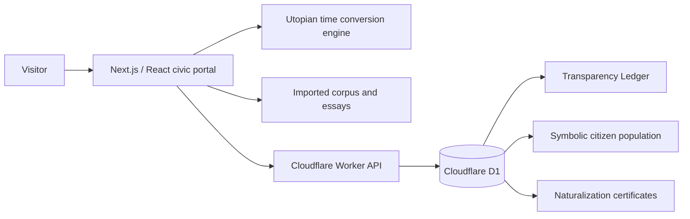

# The Utopian Society Civic Portal

[](https://utopiansocietycorpus.org/)
[](./LICENSE)
[](#how-codex-and-gpt-56-were-used)

The Utopian Society Civic Portal transforms a speculative constitutional corpus into an explorable digital civilization. Its public beta combines long-form governance and cultural writing with an interactive Celtic frontispiece, a native civil calendar, civic-service interfaces, symbolic naturalization, a public population count, and a hash-linked Transparency Ledger.

This repository documents the substantial software expansion completed for **OpenAI Build Week, July 13–21, 2026**.

> **Status:** Public beta. The project is an experimental civic and literary platform, not a sovereign government, legal nationality service, medical provider, or adjudicative authority.

## Live project

- Portal: <https://utopiansocietycorpus.org/>
- Civic directory: <https://utopiansocietycorpus.org/circles>
- Immigration interface: <https://utopiansocietycorpus.org/circles/immigration>
- Transparency Ledger: <https://utopiansocietycorpus.org/transparency-ledger>

No account is required to explore the public beta.

## Inspiration and provenance

The Utopian Society began in 2025 as a body of writing rather than a software project: a Constitution, Articles, Charters, Codices, essays, lore, and the novel *Robyn's Journey*. An early WordPress alpha made those works readable online, but the experience remained primarily a collection of documents.

During Build Week, the existing corpus was meaningfully extended into a new application. The work in this repository turns the Society's philosophy into navigable and testable civic architecture while preserving a clear distinction between imaginative nation-building and present-day legal reality.

## What the beta does

- Presents a responsive five-ring Celtic frontispiece with multi-level civic navigation.
- Converts UTC into Utopian Reference Time and renders a thirteen-month calendar.
- Maps seven Foundational Circles and additional operational civic bodies.
- Imports the Constitution, Articles, Charters, Codices, blogs, and essays into a unified reading system.
- Provides distinctive citizen-facing interfaces for Learning, Healing, Immigration, and other Circles.
- Runs a 100-question civic-comprehension assessment.
- Issues server-generated symbolic naturalization certificates after the assessment and voluntary oath.
- Maintains a public symbolic-citizen population count.
- Records civic and platform events in a hash-linked Transparency Ledger.
- Exposes early interfaces for proceedings, systemic review, stewardship, and future public participation.

Some civic workflows remain intentionally non-persistent prototypes. The repository and live interface identify symbolic recognition as distinct from legal citizenship.

## Build Week scope

The prose corpus predates the event. The application architecture and operational beta represented here were developed during the submission period. Timestamped commits record, among other work:

- the new Celtic visual system and interlocking navigation;
- a reconciled seven-Circle constitutional topology;
- the Utopian calendar and UTC continuity fixes;
- dedicated civic landing pages and interactive explainers;
- the immigration assessment, oath, certificate, and exit interfaces;
- server-side certificate numbering and collision handling;
- Cloudflare Worker and D1 persistence;
- the symbolic-citizen population service;
- the automated Transparency Ledger and release manifests;
- WordPress corpus and post migration into the new reading templates;
- route, link, accessibility, and production-release validation.

The commit history is retained as evidence of this extension.

## Architecture



### Main technologies

- Next.js 16, React 19, and TypeScript
- vinext, Vite, and the Cloudflare Vite integration
- Cloudflare Workers, D1, and Wrangler
- Drizzle tooling for schema-oriented development
- Custom CSS and interactive SVG
- OpenAI Codex with GPT-5.6 for iterative development
- OpenAI image generation for original civic artwork
- WordPress.com as the source of the original published corpus snapshot

## How Codex and GPT-5.6 were used

Codex running GPT-5.6 was the project's engineering, design, and continuity collaborator throughout Build Week. The collaboration was not a single code-generation prompt. It was a sustained build task in which the human creator supplied the constitutional corpus, philosophy, content authority, visual direction, acceptance decisions, and detailed critique while Codex inspected the workspace, implemented changes, tested them, and prepared deployments.

### Where Codex accelerated the workflow

1. **Corpus and topology analysis**
   Codex inventoried the existing pages and posts, organized the corpus into navigable domains, traced cross-document references, and helped detect inconsistencies that became visible only when the texts were translated into software.

2. **Constitutional continuity review**
   GPT-5.6 compared responsibilities across Articles, Charters, and Codices. This surfaced unresolved jurisdictional issues, including Healing's status as a seventh Foundational Circle, the bounded authority of Councils, Harmony's restorative jurisdiction, and the replacement of deprecated punitive terminology with the Restoration Codex.

3. **Interaction and visual implementation**
   The creator repeatedly annotated screenshots and gave pixel-level feedback. Codex refined the SVG over-under weave, ring labels, hover targets, responsive layouts, Celtic ornament, typography, and artwork integration across many iterations.

4. **Civic-service engineering**
   Codex implemented the assessment engine, oath and certificate flow, server-generated certificate identifiers, public population count, ledger APIs, D1 migrations, validation, and failure handling.

5. **Calendar continuity**
   GPT-5.6 reconciled the Charter of Time and Observance with Gregorian reference dates, implemented the conversion engine, corrected the Society's founding-year convention, and standardized weekday and date presentation throughout the portal.

6. **Debugging and recovery**
   Codex restored formulas lost during document conversion, repaired broken route imports and runtime errors, recovered the local development service after reboots, and fixed production-only corpus routing after the domain cutover.

7. **Testing and deployment**
   Codex built a rendered-route test suite, validated internal links and production builds, prepared Cloudflare infrastructure, deployed versioned releases, and registered significant changes in the public Transparency Ledger.

### Key decisions retained by the human creator

- The constitutional philosophy and all canonical civic decisions.
- The choice to preserve the rings as an interdependent weave rather than ordinary menu buttons.
- The four primary corpus domains and seven Foundational Circles.
- The Utopian calendar's terminology and governing meaning.
- Art direction, placement, opacity, accessibility, and page-by-page acceptance.
- The distinction between symbolic virtual citizenship and legal nationality.
- Public-record identity rules, privacy limits, and the prohibition on using the creator's legal identity in the Society's civic record.
- Final authorization for database writes, public deployment, and ledger entries.

This division of responsibility was central to the process: GPT-5.6 provided breadth, implementation speed, and continuity analysis; the human creator remained the source of civic authority and final judgment.

## Repository layout

```text
app/                         Next.js routes, components, data, and civic logic
cloudflare/civic-ledger/     Worker API, D1 configuration, and migrations
ledger/                      Versioned public-ledger release manifests and policy
public/                      Site artwork and imported post media
scripts/                     Ledger release registration tooling
tests/                       Rendered-route and internal-link validation
.openai/hosting.json         OpenAI Sites project configuration
```

## Run locally

### Prerequisites

- Node.js 22.13 or later
- pnpm through Corepack, or npm

### Application

```bash
git clone https://github.com/GrumpyOldMan977/UtopianSociety.git
cd UtopianSociety
corepack enable
pnpm install --frozen-lockfile
pnpm dev
```

Open <http://localhost:3000>.

The public reading experience does not require credentials. `WPCOM_ACCESS_TOKEN` is optional and is used only for private WordPress view statistics when available.

### Validate

```bash
pnpm build
pnpm test
```

The test suite renders the public route set and checks internal navigation targets.

### Civic Ledger Worker

The production beta uses a deployed Cloudflare Worker and D1 database. To inspect or run the Worker locally:

```bash
pnpm exec wrangler d1 migrations apply utopian-civic-ledger \
  --local \
  --config cloudflare/civic-ledger/wrangler.jsonc

pnpm exec wrangler dev \
  --config cloudflare/civic-ledger/wrangler.jsonc
```

The Worker expects these secrets only for protected write paths:

- `LEDGER_ADMIN_KEY` for administrative ledger and release registration.
- `TURNSTILE_SECRET` when bot verification is enabled.

Never commit `.dev.vars`, production credentials, or exported D1 data.

## Judge testing path

1. Explore the frontispiece and its layered ring navigation.
2. Select the center clock to open the Utopian calendar.
3. Open the Foundational Circles map and visit Learning, Healing, and Immigration.
4. Review the redesigned corpus reading pages.
5. Inspect the live Transparency Ledger and population record.
6. Review the immigration assessment and certificate workflow.

Final naturalization issuance creates a persistent public symbolic-citizen record. Use clearly fictional test information if exercising that final write, or stop before issuance.

## Safety and limitations

- Symbolic citizenship is not nationality, identification, a visa, residency, or constitutional citizenship.
- The care interfaces do not diagnose, accept medical uploads, or represent emergency services.
- AI does not adjudicate disputes or exercise unilateral civic authority.
- Administrative Worker routes require secrets held outside the repository.
- The public ledger favors accountable records, but future identity-bearing workflows require stronger consent, retention, appeal, and deletion policy before real-world use.

## Licensing

The **software source code** is licensed under the [GNU General Public License v3.0](./LICENSE).

The governance corpus, Constitution, Articles, Charters, Codices, essays, lore, narrative works, civic terminology, and visual artwork are **not** licensed under the GPL merely because they appear beside the software. Their copyright is retained unless an individual file expressly states otherwise. See [CONTENT-RIGHTS.md](./CONTENT-RIGHTS.md).

## Long-term direction

The immediate roadmap includes authenticated citizen accounts, consent and retention controls, fuller Circle services, proceedings and review workflows, and deeper accessibility testing.

The long-term aspiration is a lawful, peaceful, consent-based physical society governed through this constitutional structure. The beta does not claim nationhood; it develops the institutional architecture in public so it can be tested, criticized, and revised before it is ever asked to exercise real authority.
